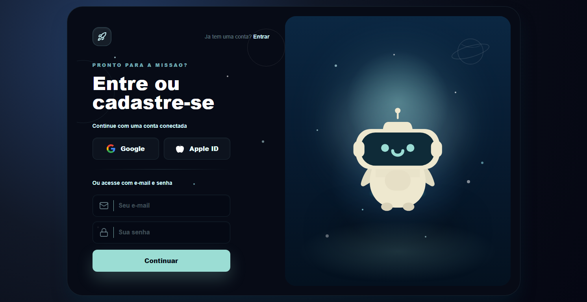
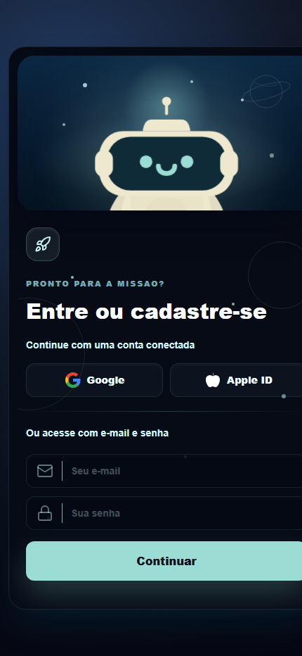

# Login Animado

Uma tela de login responsiva criada com foco em microinteracoes, personalidade visual e uma experiencia mobile mais divertida. O destaque do projeto e o mascote robo, que reage aos campos de e-mail e senha para transformar um formulario simples em uma interface com mais vida.



## Preview Mobile

<p align="center">
  
</p>

## Sobre o Projeto

Este projeto nasceu como uma tela de login experimental em Next.js, com uma composicao visual inspirada em painel espacial, cores escuras, brilho ciano e um robo animado no centro da experiencia.

A proposta foi cuidar tanto do visual quanto do comportamento: no desktop, os campos continuam digitaveis normalmente; no mobile, tocar nos campos ativa a animacao do robo sem abrir o teclado, porque a intencao principal nessa versao e demonstrar a interacao do mascote.

## Como Foi Feito

- Next.js com App Router para estruturar a aplicacao.
- React com componentes separados para campo, botao social, tela e mascote.
- Tailwind CSS para layout responsivo, efeitos visuais e acabamento.
- Framer Motion para dar movimento ao robo e aos estados de interacao.
- Lucide React para icones do formulario e do botao de marca.
- SVG customizado para desenhar o mascote diretamente no componente.

## Detalhes de Interacao

- O robo acompanha o foco dos campos.
- No campo de senha, ele muda para um estado mais timido, cobrindo os olhos.
- No campo de e-mail, a expressao fica mais ativa.
- No mobile, o toque no campo nao abre o teclado; ele funciona como gatilho visual.
- Ao tocar fora dos campos no mobile, o robo volta ao estado inicial.
- O layout mobile mantem a area do robo fixa para evitar saltos visuais.

## Rodando Localmente

Instale as dependencias:

```bash
npm install
```

Inicie o servidor de desenvolvimento:

```bash
npm run dev
```

Abra no navegador:

```text
http://localhost:3000
```

## Scripts

```bash
npm run dev
npm run build
npm run lint
```

## Estrutura Principal

```text
src/
  app/
    page.tsx
    layout.tsx
    globals.css
  components/
    TelaLogin.tsx
    MascoteRobo.tsx
    InputField.tsx
    SocialButton.tsx
  hooks/
    usePosicaoMouse.ts
```

## Ideia Para Post

Criei uma tela de login animada em Next.js com um mascote robo interativo. A ideia foi sair do formulario estatico e explorar pequenas reacoes visuais: quando o usuario interage com e-mail ou senha, o robo muda de comportamento. Tambem adaptei a experiencia mobile para priorizar a animacao, evitando que o teclado cubra a tela durante a demonstracao.

Foi um exercicio de frontend com foco em responsividade, microinteracoes, componentes reutilizaveis e acabamento visual.
